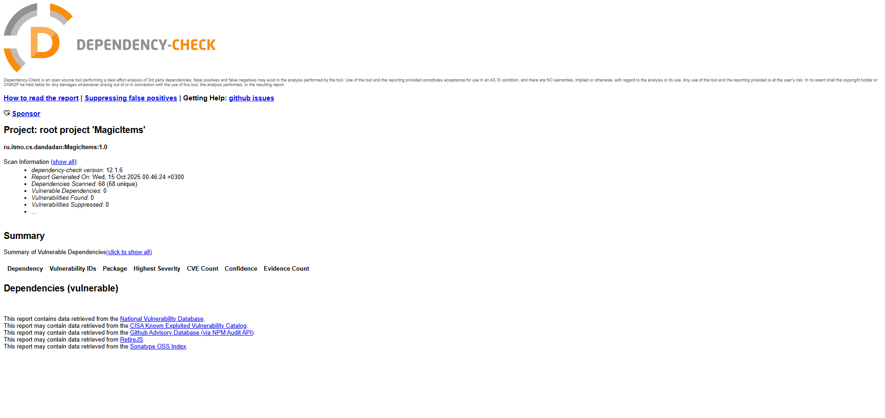

# Информационная безопасность. Лабораторная работа 1

---
## Описание проекта
Этот проект демонстрирует создание безопасного backend-приложения с помощью Java + Spring Boot, который включает:
- аутентификацию пользователей
- управление постами
- защиту от таких атак, как `SQL-инъекции`, `XSS-атаки`, `Broken Authentication`
---
## Методы API
### 1. `POST /auth/login` — Аутентификация пользователя
**Описание:** Метод принимает логин и пароль пользователя. В случае успешной аутентификации возвращает JWT-токен.

**Метод:** `POST`\
**URL:** http://localhost:8080/api/v1/auth/login \
**Запрос:**
```
POST /auth/login
```
```json
{
  "username": "{{username}}",
  "password": "{{password}}"
}
```

**Заголовки:**
```
Content-Type: application/json
```

**Успешный ответ (200 OK):**
```json
{
  "token": "eyJhbGciOiJIUzI1NiJ9..."
}
```

**Ошибки:**
- `403 Forbidden` — если логин/пароль неверны:
  ```json
  {
    "code": 400,
    "message": "Bad credentials",
    "timestamp": 1760509489173
  }
  ```
  
### 2. `GET /api/v1/magic-items` — Получение всех волшебных предметов
**Описание:** Возвращает список сущностей `MagicItems`. Доступ только для аутентифицированных пользователей (с валидным JWT).

**Метод:** `GET`\
**URL:** http://localhost:8080/api/v1/magic-items \
**Запрос:**
```
GET /api/v1/magic-items
```

**Заголовки:**
```
Authorization: Bearer <JWT_TOKEN>
Content-Type: application/json
```

**Успешный ответ (200 OK):**
```json
[
  {
    "id": "3ca83b3f-cf51-48cd-9871-36ee2b223a47",
    "name": "Rainbow Bayonet",
    "description": "Cutter of reality",
    "rarity": "GODLIKE",
    "powerLevel": 10000,
    "cooldownSeconds": 2,
    "cursed": false,
    "universalNature": "NONE",
    "createdAt": "2025-10-15T06:15:54.002888100Z"
  },
  {
    "id": "...",
    "name": "..."
    
  }
]
```

Ошибки: 
- `403 Forbidden` — если отсутствует или невалиден JWT.
  ```
  {
    "timestamp": "2025-10-15T06:30:34.412+00:00",
    "status": 403,
    "error": "Forbidden",
    "path": "/api/v1/magic-items"
  }
  ```
### 3. `POST /api/v1/magic-items` — Добавление нового волшебного предмета
**Описание:** Добавляет новую сущность `MagicItem` в список. Доступ только для аутентифицированных пользователей. 
**Метод:** `POST`\
**URL:** http://localhost:8080/api/v1/magic-items \
**Запрос:**
```
POST /auth/login
```
```json
{
  "name": "Rainbow Bayonet",
  "description": "Cutter of reality",
  "rarity": "GODLIKE",
  "powerLevel": 10000,
  "cooldownSeconds": 2,
  "cursed": false,
  "universalNature": "NONE"
}
```
**Заголовки:**
```
Authorization: Bearer <JWT_TOKEN>
Content-Type: application/json
```

**Успешный ответ (200 OK):**
```json
{
  "id": "b90db3c0-b9d5-4bc2-ab6b-ca0c91baaaeb",
  "name": "Rainbow Bayonet",
  "description": "Cutter of reality",
  "rarity": "GODLIKE",
  "powerLevel": 10000,
  "cooldownSeconds": 2,
  "cursed": false,
  "universalNature": "NONE",
  "createdAt": "2025-10-15T06:35:21.863282500Z"
}
```
**Ошибки:**
- `403 Forbidden` — если отсутствует или невалиден JWT.
  ```json
  {
    "timestamp": "2025-10-15T06:30:34.412+00:00",
    "status": 403,
    "error": "Forbidden",
    "path": "/api/v1/magic-items"
  }
  ```
- `400 Bad Request` — если не пройдена серверная валидация объекта запроса.
  ```json
  {
    "code": 400,
    "message": "Could not commit JPA transaction",
    "timestamp": 1760510244550
  }
  ```
### 4. `GET /api/v1/magic-items/{id}` — Получение волшебного предмета по его `ID`
**Описание:** Возвращает сущность `MagicItems`, соответствующий передаваемому `ID`. Доступ только для аутентифицированных пользователей (с валидным JWT).

**Метод:** `GET`\
**URL:** http://localhost:8080/api/v1/magic-items/{id} \
**Запрос:**
```
GET /api/v1/magic-items/{id}
```

**Заголовки:**
```
Authorization: Bearer <JWT_TOKEN>
Content-Type: application/json
```

**Успешный ответ (200 OK):**
```json
{
  "id": "3ca83b3f-cf51-48cd-9871-36ee2b223a47",
  "name": "Rainbow Bayonet",
  "description": "Cutter of reality",
  "rarity": "GODLIKE",
  "powerLevel": 10000,
  "cooldownSeconds": 2,
  "cursed": false,
  "universalNature": "NONE",
  "createdAt": "2025-10-15T06:15:54.002888100Z"
}
```

**Ошибки:**
- `403 Forbidden` — если отсутствует или невалиден JWT.
  ```json
  {
    "timestamp": "2025-10-15T06:30:34.412+00:00",
    "status": 403,
    "error": "Forbidden",
    "path": "/api/v1/magic-items"
  }
  ```
- `404 Not Found` — если отсутствует волшебный предмет, соответствующий заданному `ID`.
  ```json
  {
    "status": 404,
    "error": "Предмета с id = 3ca83b3f-cf51-48cd-9871-36ee2b223ab1 не существует.",
    "timestamp": 1760509489024
   }
  ```
  
## Реализованные меры защиты
API использует **JWT-токены** для защиты эндпоинтов.
- Пользователь проходит аутентификацию через POST /auth/login.
- В ответ получает accessToken (JWT).
- Для доступа к защищённым эндпоинтам необходимо передавать токен в заголовке:
```Authorization: Bearer <JWT>```

### Противодействие SQL Injection (SQLi)
Используется Spring Data JDBC, который применяет параметризованные запросы → данные подставляются безопасно, без конкатенации SQL-строк.
Таким образом, классические SQLi невозможны.

**Реализация:**
```java
@Repository
public interface MagicItemRepository extends JpaRepository<MagicItem, UUID> {
}
```

### Противодействие XSS
REST API возвращает только JSON и не исполняет JavaScript.
Устанавливаются следующие заголовки HTTP:
```
X-XSS-Protection: 1; mode=block
Content-Security-Policy: script-src 'self'
```

**Реализация:**
```
            .headers(headers ->
                        headers.xssProtection(
                                xss -> xss.headerValue(XXssProtectionHeaderWriter.HeaderValue.ENABLED_MODE_BLOCK)
                        ).contentSecurityPolicy(
                                cps -> cps.policyDirectives("script-src 'self'")
                        ));
```
### Реализация аутентификации
- Используется JWT-токен, который подписывается секретным ключом (`HMAC SHA-256` подпись).
- Само хэширование реализуется путём использования `BCrypt`.
- Токен проверяется middleware (Spring Security `OncePerRequestFilter`).
- Без токена доступ к защищённым эндпоинтам (`/api/v1/magic-items`) запрещён.

**Реализация:**
```
http.csrf(AbstractHttpConfigurer::disable)
                .authorizeHttpRequests(auth -> auth
                        .requestMatchers("api/v1/auth/login").permitAll()
                        .requestMatchers("/api/v1/magic-items").authenticated()
                        .anyRequest().permitAll()
                )

...

http.addFilterBefore(jwtFilter, UsernamePasswordAuthenticationFilter.class);
```
## Отчёты SAST/SCA


## Отчёты OWASP


